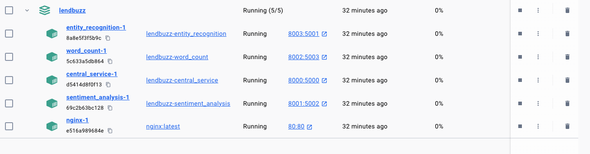
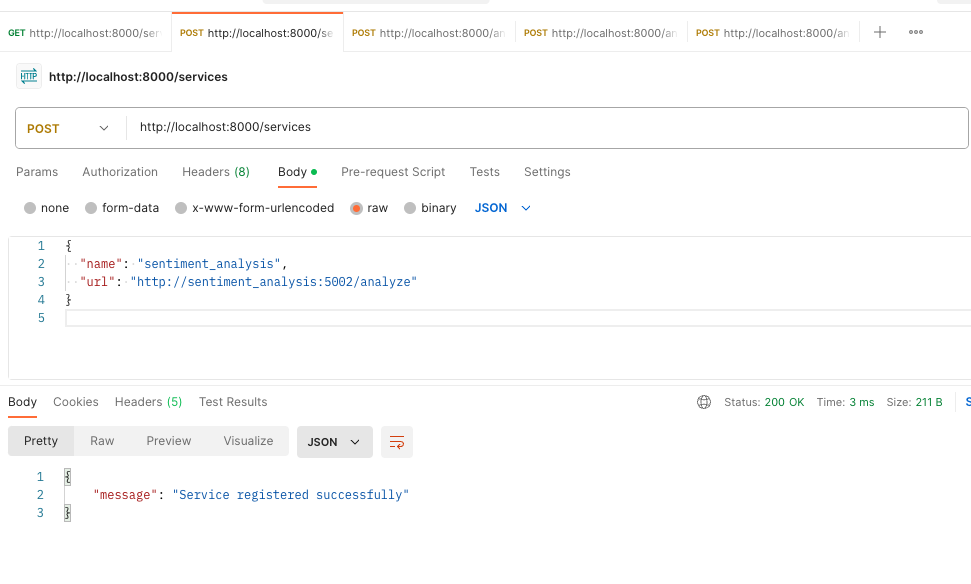
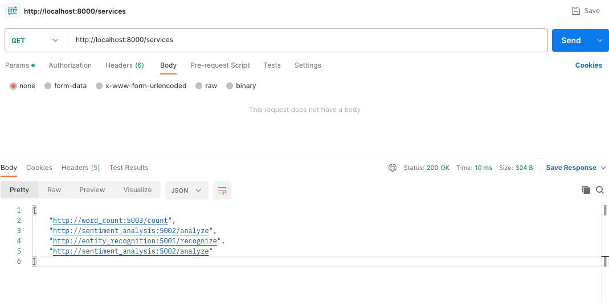
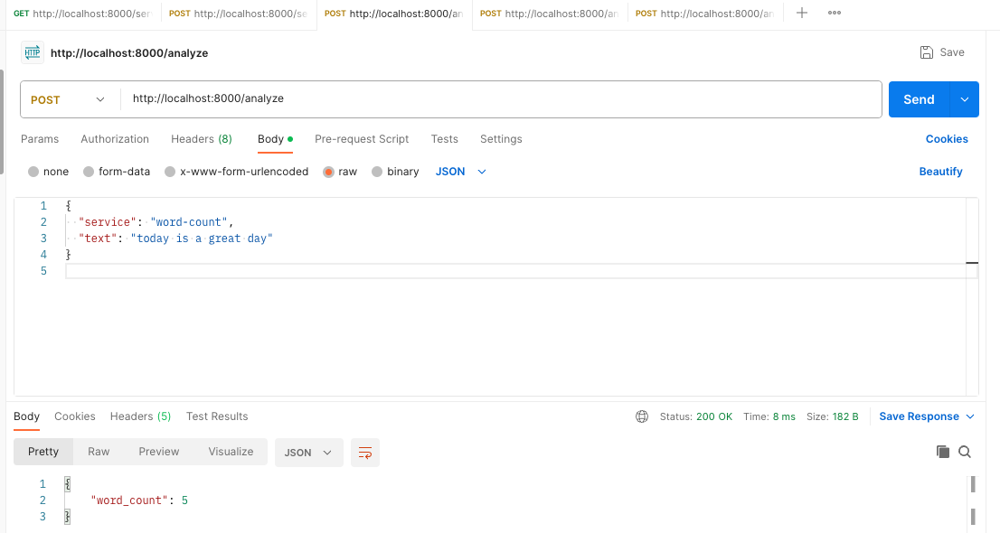
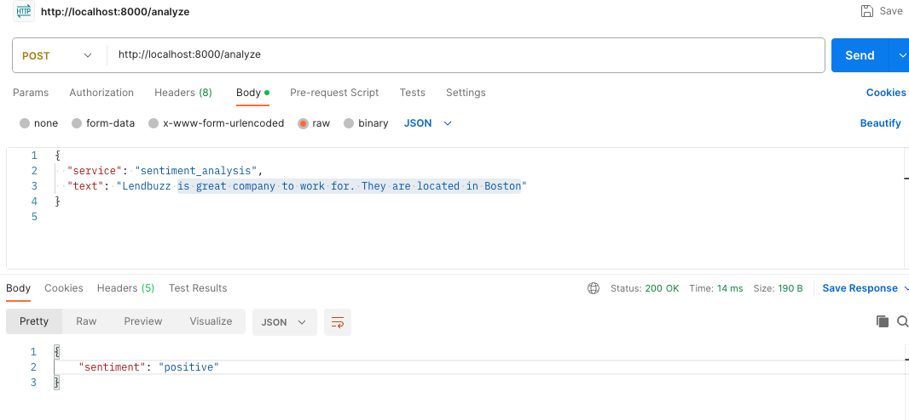
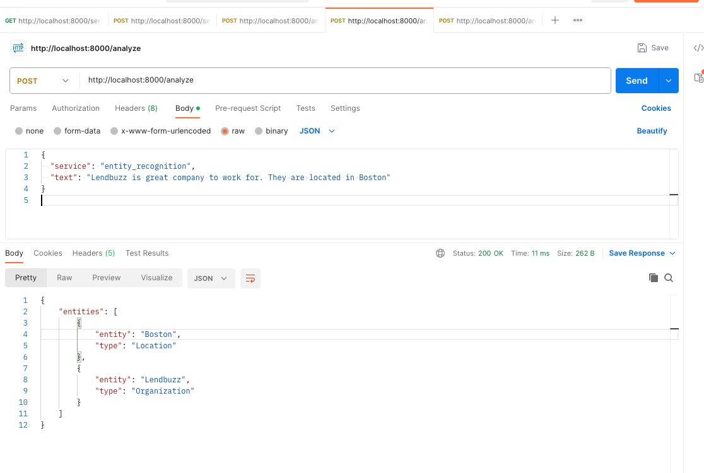

# Text Analysis Simple Microservices In Python Flask 

This project is a microservices-based text analysis system, consisting of several independent services including a central service that acts as a gateway and service registry, and various simple text analysis services.

## Services

- **CentralService**: Manages the registry of text analysis services and routes client requests.
- **SentimentAnalysisService**: Analyzes the sentiment of the provided text.
- **WordCountService**: Counts the number of words in the provided text.
- **EntityRecognitionService**: Identifies named entities in the text.


### Prerequisites

What things you need to install the software and how to install them:

- Docker
- Postman (for testing the backend API)


## Getting Started
### Installing

A step by step series of examples that tell you how to get a development env running:

1. Clone the repository:

   ```bash
   git clone https://github.com/mohammedMmahmud/Lendbuzz-Take-Home-Test.git
    ```

2. Build the docker images:
<br>
<b>If you're running on Windows and run into port issues, then you have to change the port in the `docker-compose.yml` file. Change all the ports from the 8000 to the 5000 range.</b>

   ```bash
    docker-compose build --no-cache
   ```
   ```bash
    docker-compose up -d 
   ```
   Your docker container should look like this if everything is successful.
   

3. Now register the Microservices services using Postman. Go to `http://localhost:8000/services` And make sure you change it to post method. Screenshot below shows how to do it.
     
     <br>
     This is how you register all the services. Here are the following URLs for each service:
     <br>
     Note: `name` can be anything you want. 
        <br>
        - SentimentAnalysisService: `http://sentiment_analysis:5002/analyze`
        <br>
        - WordCountService: `http://word_count:5003/count"`
        <br>
        - EntityRecognitionService: `http://entity_recognition:5001/recognize`


4. Once you register all services when you send a get request You should get Result similar to this 


5. Microservice for Word Count. 


6. Microservice for Sentiment Analysis. 


7. Microservice for Entity Recognition. 



<br>

I added nginx to the project to make it easier to access the services But for these examples, I didn't use it. You can use it directly by going to `http://localhost/central_service/services` and put post request.

```json
{
  "name": "sentiment_analysis",
  "url": "http://sentiment_analysis:5002/analyze"
}
```
